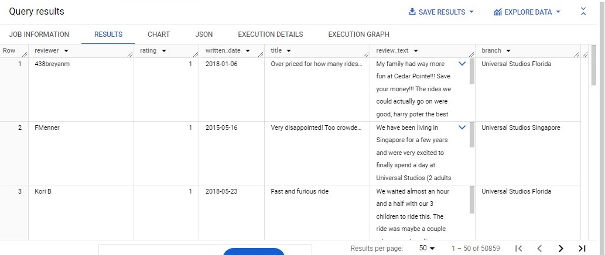
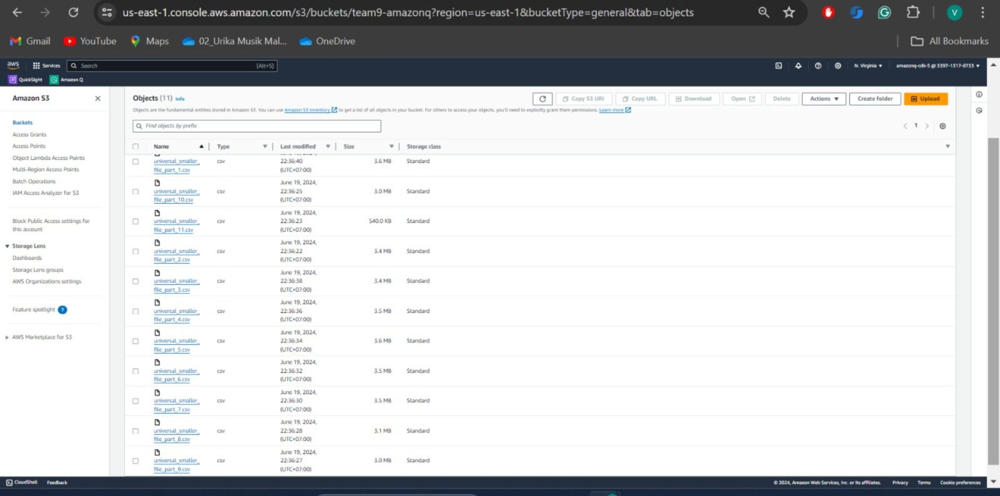
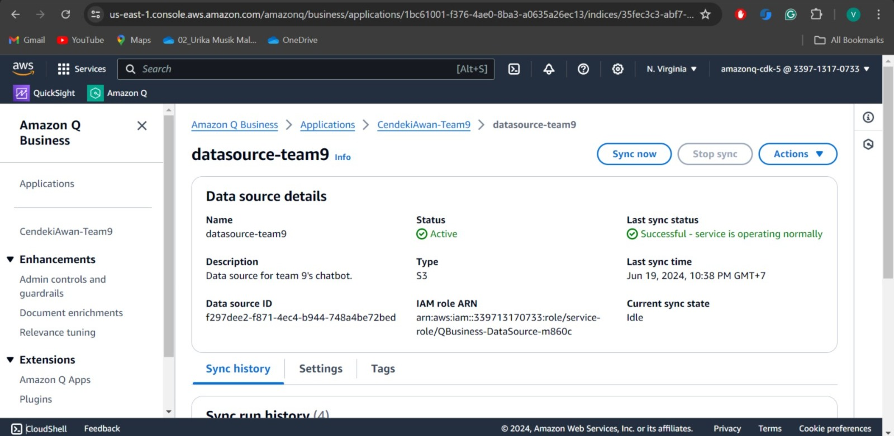
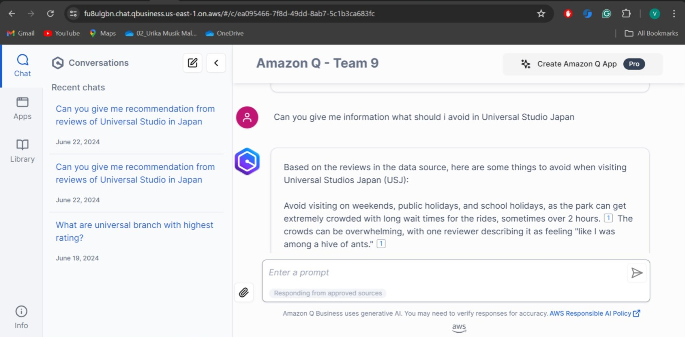

# capstone_revou_chatbot

| Name           | University       | Role     |
| ---            | ---        | ----------|
| M. Fairuz Ramadhani | Universitas  Sriwijaya | Project Leader |
| Rr. Diajeng Alfisyahrinnisa Anandha | Institut Teknologi Sepuluh Nopember | Data Cleaner |
| Vania Faustina G | Sekolah Tinggi Ilmu Komputer Malang | Data Cleaner |
| Setyo Harry Nugroho | Universitas Muhammadiyah Sumatera Utara  | Data Analyst |
| Ario Nugraha R. | Universitas Indonesia | Data Communication |
| Alvian Nur Firdaus | Politeknik Negeri Malang | Data Communication |


# Dataset
https://www.kaggle.com/datasets/dwiknrd/reviewuniversalstudio

# Cleaning with MYSQL

## 1. Dari dataset tersebut, kita lakukan cleaning untuk menangani duplicate review

### Syntax MYSQL:

```
WITH DuplicateReviews AS (
  SELECT
    reviewer,
    rating,
    written_date,
    title,
    review_text,
    branch,
    ROW_NUMBER() OVER (PARTITION BY reviewer, rating, written_date, title, review_text, branch) AS row_num
  FROM
    universal_studio
)
SELECT
  reviewer,
  rating,
  written_date,
  title,
  review_text,
  branch
FROM
  DuplicateReviews
WHERE
  row_num = 1;
```

### Hasil:
<br></br>

## 2. Setelah kita cleaning data tersebut, kita masukkan hasil CSV ke AWS S3

<br></br>

## 3. Lalu klik data source tersebut ke AWS Q dan sync now

<br></br>

## 4. Setelah itu, Amazon Q dapat mulai dijalankan

<br></br>